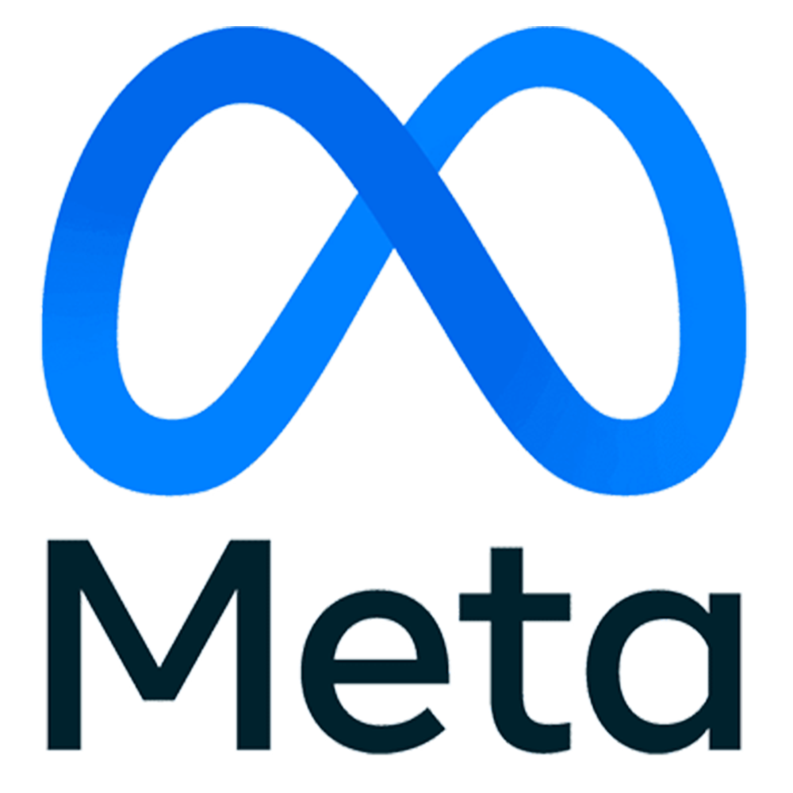

# Monorepo

Scale your code like a pro.

---
layout: center
---

# Why do companies use Monorepos?

<div class="flex space-x-xl">
    
    
    
    
</div>

---

# Short Answer...

<v-click>
<ul>
    <li>Manage complexity</li>
    <li>Organization-wide best practices</li>
    <li>Maximizing shared code</li>
    <li>Consistency & predictability in code</li>
    <li>Discoverability and communication</li>
    <li>Increased collaboration</li>
</ul>
</v-click>

---

# Long Answer...

<v-click>
What this talk is all about. 😀
</v-click>

---
layout: center
---

# What is a Monorepo?

---
layout: center
---

<div class="text-4xl">
    A Monorepo is a single repository<br />
    containing multiple distinct projects<br />
    with well-defined relationsships.
</div>

---
layout: center
---


---

# Advantages of Polyrepos

<v-click>
<ul>
    <li>Reduced complexity per repository</li>
    <li>Flexibility in choosing tech-stack, tools & libs</li>
    <li>Pushing code is easier & faster</li>
    <li>Optimized build & deployment pipeline per repository</li>
    <li>Ownership & Responsibility per repository</li>
</ul>
</v-click>

---

# Challanges with Polyrepos

<v-click>
<ul>
    <li><b>Depencency management</b></li>
    <li>Hindered library maintenance</li>
    <li>Feature division</li>
    <li>Increased probability of introducing bugs</li>
    <li>Browsing sources is harder</li>
    <li>No common guildelines</li>
    <li>Communication & Planning overhead</li>
</ul>
</v-click>

---

# Advantages of Monorepos

<v-click>
<ul>
    <li>High level view of projects</li>
    <li>Increased discoverability (Code, Project & Architecture)</li>
    <li>Increased collaboration</li>
    <li>Easier dependency management</li>
    <li>Implement a feature in 1 PR</li>
    <li>Enforcement of common guidelines</li>
</ul>
</v-click>

---

# Challanges with Monorepos

<v-click>
<ul>
    <li>Scaling issues (# of projects, CI time)</li>
    <li>Increased complexity (# of projects, dependencies, Code/Project navigation)</li>
    <li>Different tech stacks</li>
    <li>Potential for conflicts on code-level</li>
    <li>Cultural, organizational & skill-related issues</li>
    <li>Ownership</li>
</ul>
</v-click>

---

<div class="flex w-full items-center justify-between">
    <div class="flex space-x-lg items-center">
        
        <span class="text-4xl">to the rescue</span>
    </div>
    
</div>

---

# What is nx?

- node.js-based tool set for managing multiple projects in a single repository
- Takes advantage of npm/pnpm/yarn workspaces
- Much emphasis on speed
- Open Source & Free to get started (100 CI builds per month)
- Paid subscriptions for extendend features ($249 / month)

---

# Project graph

https://nx.dev/features/explore-graph


---

# Task Execution

https://nx.dev/features/run-tasks

Run a single task on a single project or multiple tasks on multiple projects or
even only affected tasks based on Git changes.

```bash
> nx run myapp:build
```

```bash
> nx run-many -t test
> nx run-many -t lint,build,test
> nx run-many -t lint,build,test -p proj1 proj2
> nx run-many -t lint,build,test --projects=tag:type:ui
```

```bash
> nx affected -t test
> nx affected -t lint,build,test
```

---

# Distributed Task Execution ($$$)

https://nx.dev/ci/features/distribute-task-execution

- CI feature to split task executions on multiple build machines
- Collect the task execution outputs
- Based on heuristics
- Split of e2e tests to execute on multiple nodes
- Flaky test detection & retry mechanisms

---

# Caching

https://nx.dev/features/cache-task-results

## never do the same thing twice

- drastically speeds up your task execution times while developing locally, in
  the team, and even more in CI
- saves you money on CI/CD by reducing the number of tasks that need to be
  executed

## What is cached?

- Terminal output
- Task artifacts
- Hash over the inputs (source code, runtime, command line args)

---

# Configuration

https://nx.dev/reference/nx-json |
https://nx.dev/reference/project-configuration

nx.json

```json
{
  "targetDefaults": {
    "format": {
      "cache": true
    },
    "lint": {
      "cache": true
    },
    "build": {
      "dependsOn": ["^build"],
      "cache": true
    },
    "test": {
      "dependsOn": ["build"],
      "cache": true
    }
  }
}
```

---

# Nx Powerpack ($$$)

https://nx.dev/blog/introducing-nx-powerpack

- Run language agnostic conformance rules (+ the ability to create new rules)
- Define code ownership at project level
- Change the remote cache storage location

---

# Plugins

https://nx.dev/plugin-registry |
https://nx.dev/extending-nx/intro/getting-started

- Many plugins available for different tech stacks, libraries & tools
- Possibility to extend nx with own plugins, generators and migrations

<v-click>
    <div class="position-absolute bottom-12 right-12">
        
    </div>
</v-click>

---
layout: center
---

# Demo Time!

---

# References

- https://monorepo.tools/
- https://nx.dev/
- [nx-monorepo - A solid starting point for your new Nx-based monorepo.](https://github.com/froko/nx-monorepo)
- [dotnet-monorepo - A solid starting point for your new Nx-based .NET monorepo](https://github.com/froko/dotnet-monorepo)
