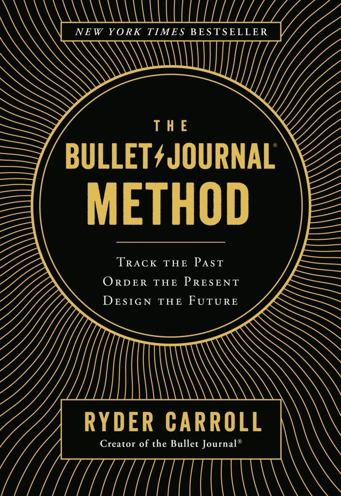
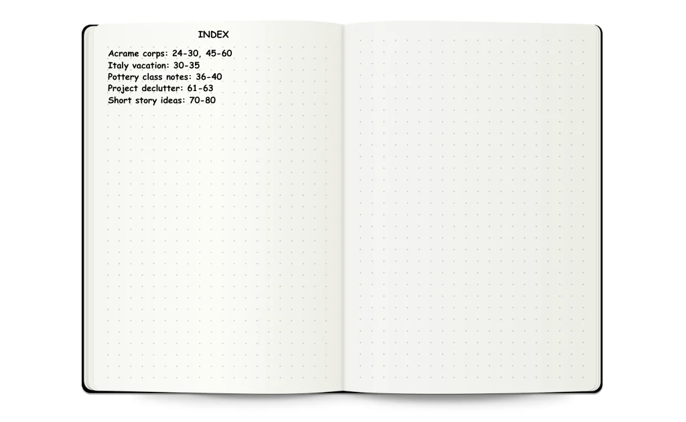
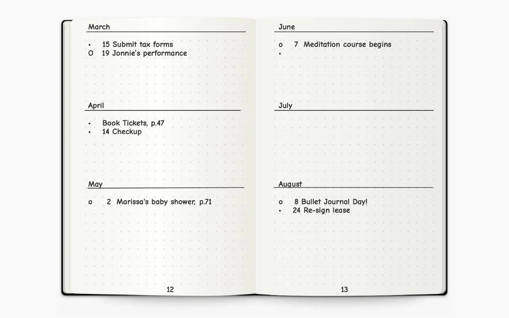
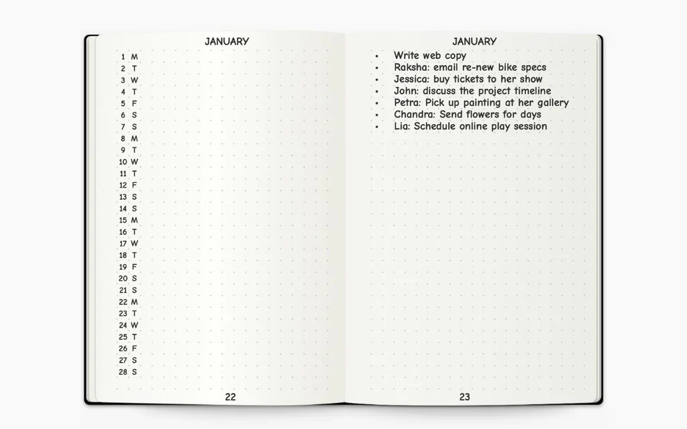
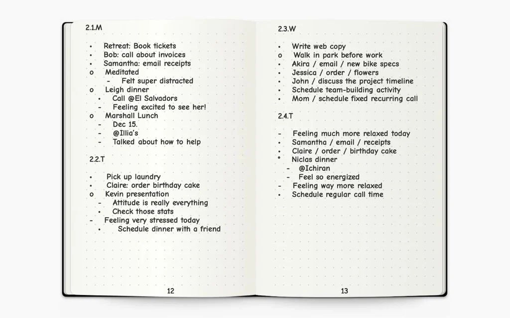
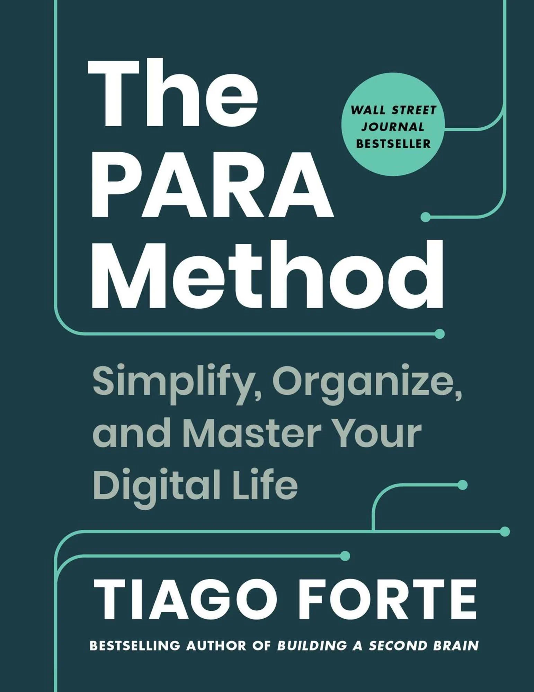
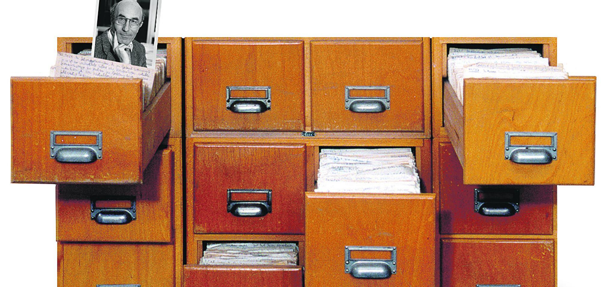
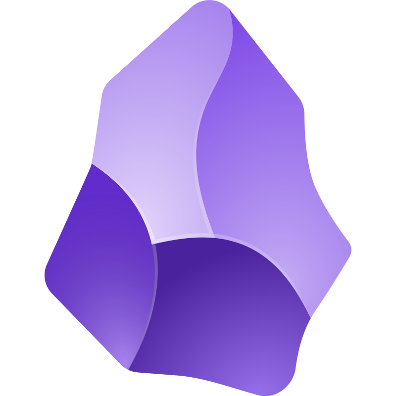

# Note Taking

The art of building a second brain.

---

# Why take notes?

<v-click>
<ul>
    <li>To remember things.</li>
    <li>To organize information.</li>
    <li>To learn.</li>
    <li>To plan.</li>
</ul>
</v-click>

---

# 3 Approaches (among many others...)

- Bullet Journal
- PARA Method
- Zettelkasten

---

    

        <h1>Bullet Journal</h1>
        <ul>
            <li>Developed by Ryder Carrol</li>
            <li>Paper-based</li>
            <li>Low entry barrier</li>
            <li>One-stop-shop for all your notes & tasks</li>
        </ul>
    

    

---

# Bullet Journal: The Method

## What do I need?

- A paper notebook
- A pen

## How does it work?

- Constant process of refinement, reflection and documentation
- Become aware of what we do and why we do it
- Based on a method called "Rapid Logging"

---

# Bullet Journal: The Essentials

- Index
- Future Log (Multiple Months)
- Monthly Log
- Daily Log
- Collections (Points of Interest, Expenses, Trackers, Holyday Planner, ...)

---

<h1 class="text-center">Bullet Journal: Index</h1>

---

<h1 class="text-center">Bullet Journal: Future Log</h1>

---

<h1 class="text-center">Bullet Journal: Monthly Log</h1>

---

<h1 class="text-center">Bullet Journal: Daily Log</h1>

---

# Bullet Journal: Signifiers

| Signifier | Meaning        | Description                                                                                            |
| --------- | -------------- | ------------------------------------------------------------------------------------------------------ |
| o         | Event          | Date-Related (e.g. "Mia's birthday) or logged after they occur (e.g. Walkked in park before work) |
| -         | Note           | Facts, Ideas, Thoughts, Observations - no action required                                              |
| ·         | Task           | Actionable item                                                                                        |
| X         | Task completed |                                                                                                        |
| >         | Task migrated  | moved forward to next day or next month                                                                |
| <         | Task migrated  | moved backward to current month                                                                        |

---

# Bullet Journal: Personal Experience

- Practice: 4+ Years
- Sometimes more, Sometimes less
- Started with pen & paper - now with remarkable2
- Monthly planning helps find conflicts
- Needs some effort to make it a habbit
- Plan time to refine & reflect
- Good feeling / Dopamine release if a task can be completed
- Helps best for short term task planning (1-2 days)
- Many open tasks can feel overwhelming

---

    

        <h1>The PARA Method</h1>
        <ul>
            <li>Developed by Tiago Forte</li>
            <li>Digital Method</li>
            <li>Low entry barrier</li>
            <li>Part of a larger method called "Building a 2nd Brain"</li>
        </ul>
    

    

---

# PARA: The Method

PARA is an acronym for

- Projects
- Areas
- Resources
- Archive

Each term represents a folder to put stuff in.

It's sorted by actionability.

The folder structure can be applied not only for notes but also for your file
system or your bookmark list.

---

# PARA: Projects

Short-term efforts in your work or life that you're working on now

- First level and foremost of actionability
- Duration: Up to 6 - 12 months
- Projects can be migrated into an Area if involvment is going on or can be
  archived if completed
- A project item may hold a goal, a task list, notes, references, links, etc.

Examples:

- Complete webpage design
- Buy a new computer
- Write a research report
- Set up new living room furniture

---

# PARA: Areas

Long-term responsibilities you want to manage over time

- Work responsibilities such as Marketing, Human Resources, Product Management,
  Research and Development, Direct Reports, or Engineering
- Personal responsibilities such as Health, Finances, Kids, Writing, Car, Home
  or Associations

---

# PARA: Resources

Topics or interests that may be useful in the future

Examples:

- Graphic design
- Marketing assets
- Personal productivity
- Organic gardening
- French literature
- Photography
- Programming Languages
- Programming Tools
- Keyboard Shortcuts
- Code Snippets

---

# PARA: Archive

Inactive items from the other three categories

You don't delete informations unless you're absolutely sure to do so. The
Archive helps you maintain the PARA items in a clean state. You might want to
save items for future reference:

- Projects you’ve completed or put on hold
- Areas that are no longer active or relevant
- Resources that you’re no longer interested in

---

    

        <h1>The Zettelkasten Method</h1>
        <ul>
            <li>Developed by Niklas Luhmann</li>
            <li>Originally completely analog</li>
            <li>Adopted to the digital world</li>
            <li>Requires some experience and a lot of commitment</li>
            <li>Needs to have a purpose</li>
        </ul>
    

    

---

# Zettelkasten: The Method

A Zettelkasten is a personal tool for thinking and writing. It has hypertextual
features to make a web of thought possible. The difference to other systems is
that you create a web of thoughts instead of notes of arbitrary size and form,
and emphasize connection, not a collection.

- Motivation: Luhmann published 50 books and over 600 articles thanks to his
  Zettelkasten
- No folder structure by purpose: Each and every note lives in the same spot
- Every information is written on a single slip
- Physical constraint of the slip: Forces the author to express an idea as short
  and concise as possible

---

# Zettelkasten: Type of Notes

- **_Fleeting Notes_**: Spontaneous ideas that need further investigation
- **_Literature Notes_**: Notes from reading a book, listening to a podcast or
  watching a YouTube video
- **_Permanent Notes_**: The essence of a Zettelkasten: Carefully crafted and
  interconnected information based on Fleeting- and/or Literature notes

---

# Zettelkasten: Personal Thoughts

- Seems to be very attracting based on Luhmann's success and based on other
  people's experiences shared on YouTube
- Needs a lot of practice and commitment
- The Zettelkasten on its own is just the tool. The things you can make out of
  it is what's counting.
- Needs to have a purpose (typically content creation): YouTube Channel,
  Podcast, Blog, ...
- A Zettelkasten can be integrated in the Resources folder of the PARA method in
  case you want to try it out

---

    

        <h1>App Suggestion: Obsidian</h1>
        <ul>
            <li>Freeware</li>
            <li>Markdown-based</li>
            <li>Supports note templates</li>
            <li>Easy sync - either via Cloud or via paid subscription</li>
            <li>Lots of plugins - but use them wisely</li>
            <li>Available on all OS and even on mobile devices</li>
            <li>Geek tip: There is an Obsidian plugin available for NeoVim</li>
        </ul>
    

    

---

# Some tips and best practices

- Create an inbox: Lowers the barrier to create new information without having
  to decide upfront where it needs to go
- Take some daily or weekly time to process your inbox. Don't be affraid to
  delete items with no value
- Start small and simple: Let the system evolve
- Be patient and committed for some time: Success will come eventually - If not:
  feel free to abandon the experiment

---

# Common Pitfalls

- Making the system too complex: Voids the ability to quickly add new
  information
- Information horting: Taking notes without a purpose
- Excessive consumption: Over-consuming information form countless sources
- Self procrastination: Optimizing or restructuring your notes without adding
  something meaningful or taking advantage of the notes
- Lack of commitment: Hopping from one method/application to another: Stick with
  a chosen system for at least 6 months

---
layout: two-cols
---

# Note Taking

- Capture and preserve what others have expressed
- Fast method of recording information
- Popularized during school or study
- Taking notes lets you know more
- Less sustainable than Note Making

::right::

# Note Making

- Create notes in your own words
- Forces you to understand the topic you writing about
- Builds up deep knowledge by taking into account what you already know
- Takes more time than note taking
- Similar to permanent notes in the Zettelkasten

---

# References

- https://bulletjournal.com/
- https://fortelabs.com/blog/para/
- https://www.buildingasecondbrain.com/
- https://zettelkasten.de/
- https://obsidian.md/
